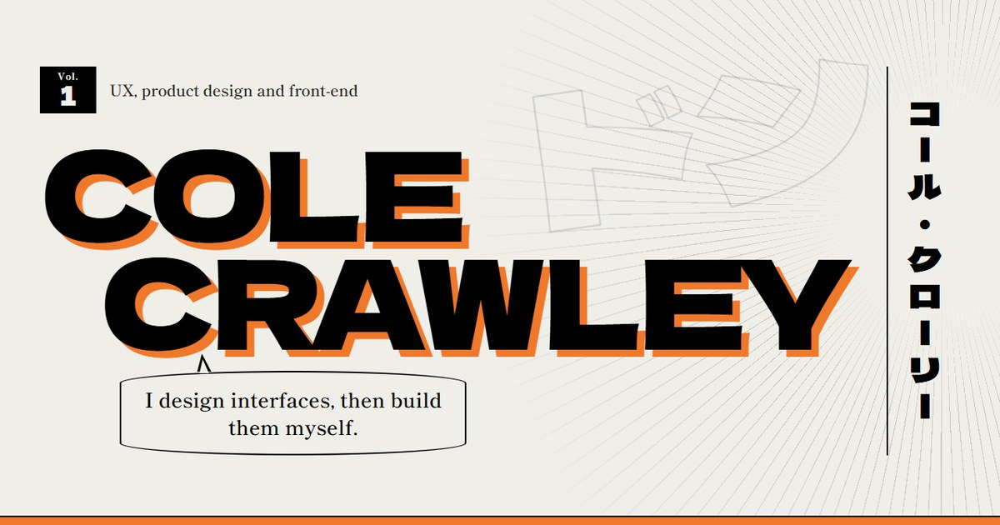

# Cole Crawley, portfolio

**[colecrawley.vercel.app](https://colecrawley.vercel.app)**

My design portfolio, laid out like a volume of manga. The home page is the cover, the project list is a page of comic panels, and every project is a chapter with its own colour page, borrowed from a series I love: Naruto, Bleach, JoJo's Bizarre Adventure and One Piece. Everything inside is black ink on newsprint.



---

## What's in it

- **Five chapters and a bonus.** MMDriving (client work), Distill (MSc dissertation), Card Scanner (BSc dissertation), BaconAI, CodeMarker, and Pawned Out as a bonus chapter.
- **An "In short" box on every chapter.** Most people skim, so each case study opens with what it is, what I did, the result, and a button to try it.
- **Colour only where it means something.** Screenshots on the contents page are printed in greyscale screentone and turn to full colour when you point at them.
- **A CV that matches.** `cv/cv.html` is the source for `cv/Cole_Crawley_CV.pdf`, set in the same type as the site.

---

## How it's built

Plain HTML and CSS, with a few lines of JavaScript for the scroll reveals. No framework and no build step.

- Design tokens live in `css/tokens.css`, including one palette per chapter set with a `data-series` attribute.
- Page-to-page transitions use cross-document view transitions, and the reading progress bar is a scroll-driven animation, so both work without JavaScript.
- Everything respects reduced motion, and every page is complete with JavaScript turned off.
- Type is Dela Gothic One for display and Shippori Mincho for reading.

---

## Running it locally

It's static, so any local server works:

```bash
python -m http.server 8000
```

Then open [http://localhost:8000](http://localhost:8000).

*Designed and built by Cole Crawley.*
